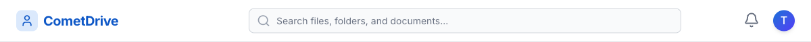
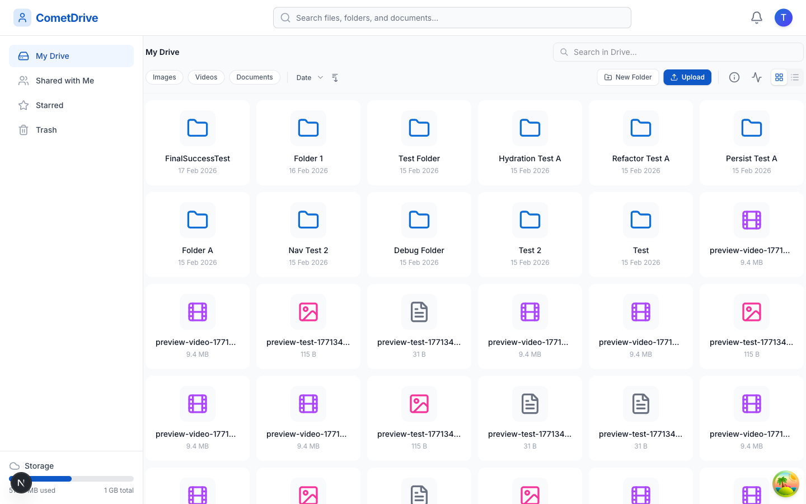

# CometDrive

<p align="center">
  <strong>Collaboration-ready file management monorepo built with NestJS, Next.js, and Nx.</strong>
</p>

<p align="center">
  CometDrive starts as a production-minded full-stack boilerplate and already ships with secure authentication, organization-aware access control, file storage, sharing flows, notifications, and a polished drive experience.
</p>

<p align="center">
  
  
  
  
  
  
  
</p>

<p align="center">
  
</p>

<p align="center">
  
  
</p>

## Overview

CometDrive is an Nx monorepo that pairs a NestJS API with a Next.js App Router frontend and shared workspace packages. It is structured like a reusable boilerplate, but `main` already includes enough product surface to act as a real collaboration and file-management foundation for internal tools, SaaS products, or client portals.

It comes with a secure backend, a responsive drive UI, reusable mail and SMS packages, database migrations, end-to-end testing hooks, and deployment scaffolding for both local and hosted environments.

## What Ships On `main`

<table>
  <tr>
    <td width="50%" valign="top">
      <strong>Identity and access</strong><br />
      Open registration, JWT access and refresh tokens, database-backed sessions, password reset flows, RBAC, and organization-aware guards.
    </td>
    <td width="50%" valign="top">
      <strong>Drive experience</strong><br />
      Nested folders, uploads, inline previews, starred items, trash and restore flows, ZIP downloads, signed URLs, and storage usage indicators.
    </td>
  </tr>
  <tr>
    <td width="50%" valign="top">
      <strong>Collaboration</strong><br />
      Share links, private recipient shares, password-protected public downloads, expiry controls, comments, video timestamp comments, continue-watching, and notifications.
    </td>
    <td width="50%" valign="top">
      <strong>Production workflow</strong><br />
      Swagger docs, PostgreSQL migrations, Redis support, local or S3-backed file storage, Jest and Playwright coverage, Docker Compose, and Render deployment config.
    </td>
  </tr>
</table>

## Core Capabilities

### Backend

- JWT auth with refresh tokens and revocable sessions
- Role-based access control and multi-tenant organization isolation
- Swagger/OpenAPI docs and request validation with `class-validator`
- PostgreSQL persistence with Sequelize, migrations, and seeders
- Redis-backed infrastructure hooks
- Local storage strategy with optional S3 strategy
- Email flows through [`packages/mailer`](./packages/mailer/README.md)
- SMS flows through [`packages/sms`](./packages/sms/README.md)

### Frontend

- Next.js 16 App Router with React 19
- Tailwind CSS, SCSS, TanStack Query, Zustand, and Zod
- Authenticated drive shell with storage meter and notifications
- Shared-with-me, Starred, Trash, Settings, and public share routes
- File preview experiences for common document and media flows
- Collaboration UI for comments and video review

### File and Collaboration Flows

- Upload files into folders and browse nested structures
- Search, sort, star, move, trash, restore, and permanently delete files
- Download individual files or bulk ZIP archives
- Resume video playback with continue-watching state
- Leave timestamped comments on video assets
- Create public or recipient-specific shares with optional:
  - expiry dates
  - viewer or editor permissions
  - password protection
  - download enablement controls
- Invite users into the workspace and surface in-app notifications

## Architecture At A Glance

| Layer     | Stack                                                            | Notes                                                                             |
| --------- | ---------------------------------------------------------------- | --------------------------------------------------------------------------------- |
| Frontend  | Next.js 16, React 19, Tailwind CSS, TanStack Query, Zustand, Zod | App Router client with authenticated and public share flows                       |
| Backend   | NestJS 11, Swagger, Sequelize, PostgreSQL, Redis                 | Modular API with auth, storage, sharing, invitations, comments, and notifications |
| Storage   | Local filesystem or Amazon S3                                    | Strategy-based storage service with signed URL support                            |
| Workspace | Nx monorepo, npm workspaces, TypeScript 5.9                      | Shared tooling and app/package orchestration                                      |
| Quality   | Jest, Playwright, ESLint, Prettier                               | Unit and end-to-end testing support across apps                                   |

## Workspace Map

```text
.
├── apps/
│   ├── backend/         # NestJS API, auth, storage, shares, comments, notifications
│   ├── backend-e2e/     # API end-to-end tests
│   ├── frontend/        # Next.js App Router client
│   └── frontend-e2e/    # Playwright coverage for user flows
├── packages/
│   ├── mailer/          # Shared Nodemailer package
│   └── sms/             # Shared Twilio package
├── docs/                # Project notes and supporting documentation
├── docker-compose.yml   # Local Postgres and Redis services
├── render.yaml          # Render deployment blueprint
└── nx.json              # Workspace orchestration and target config
```

For app-specific details, see [`apps/backend/README.md`](./apps/backend/README.md) and [`apps/frontend/README.md`](./apps/frontend/README.md).

## Quick Start

### Prerequisites

- Node.js 20+
- npm 9+
- PostgreSQL 14+
- Redis 6+ (recommended for parity with the backend config)

### 1. Install dependencies

```bash
npm install
```

### 2. Configure the backend

```bash
cp apps/backend/.env.example apps/backend/.env
```

Update `apps/backend/.env` with your database credentials, JWT secret, mail settings, and any optional storage or feature-flag values you want enabled.

### 3. Configure the frontend

Create `apps/frontend/.env.local`:

```env
NEXT_PUBLIC_API_URL=http://localhost:3001/api
```

### 4. Create the database and run migrations

The backend `.env.example` defaults to `boilerplate_db`. Either create that database or change the env value first.

```bash
createdb boilerplate_db
cd apps/backend
npm run migration:run
npm run seed:run
```

### 5. Start the apps

From the workspace root:

```bash
npx nx serve backend
npx nx dev frontend
```

### 6. Open the project

| Surface      | URL                                |
| ------------ | ---------------------------------- |
| Frontend     | `http://localhost:3000`            |
| Backend API  | `http://localhost:3001/api`        |
| Swagger Docs | `http://localhost:3001/api/docs`   |
| Health Check | `http://localhost:3001/api/health` |

## Useful Commands

| Task             | Command                   |
| ---------------- | ------------------------- |
| Start backend    | `npx nx serve backend`    |
| Start frontend   | `npx nx dev frontend`     |
| Build backend    | `npx nx build backend`    |
| Build frontend   | `npx nx build frontend`   |
| Test backend     | `npx nx test backend`     |
| Test frontend    | `npx nx test frontend`    |
| Run backend e2e  | `npx nx e2e backend-e2e`  |
| Run frontend e2e | `npx nx e2e frontend-e2e` |
| Lint backend     | `npx nx lint backend`     |
| Lint frontend    | `npx nx lint frontend`    |
| Format workspace | `npm run format`          |

### Backend migration shortcuts

```bash
cd apps/backend

npm run migration:run
npm run migration:rollback
npm run migration:status
npm run migration:fresh
npm run seed:run
```

## Configuration Notes

### Storage

The backend is wired for strategy-based storage:

- `local` storage works out of the box for development
- `s3` storage is available via `FILE_DRIVER=s3`
- S3 mode uses `AWS_ACCESS_KEY_ID`, `AWS_SECRET_ACCESS_KEY`, `AWS_DEFAULT_S3_BUCKET`, and `AWS_S3_REGION`

### Mail and SMS

- `MAIL_PREVIEW=true` opens emails in a browser during development instead of sending them
- `TWILIO_PREVIEW_MODE=true` allows SMS flows to be exercised without live delivery

### Feature flags

`apps/backend/.env.example` exposes flags you can roll out gradually:

- `FEATURE_NOTIFICATIONS`
- `FEATURE_RESOURCE_COMMENTS`
- `FEATURE_APPROVALS`
- `FEATURE_FILE_VERSIONS`
- `FEATURE_2FA`

## Deployment

### Local infrastructure

[`docker-compose.yml`](./docker-compose.yml) provides PostgreSQL and Redis services for local development and production-like backend wiring.

### Render

[`render.yaml`](./render.yaml) includes a two-service blueprint for deploying the backend and frontend separately on Render.

## Why This Repo Works Well As A Starter

- It is opinionated enough to demonstrate real product flows, not just framework wiring
- It keeps backend, frontend, and shared packages inside one maintainable Nx workspace
- It leaves clear extension points for approvals, comments, notifications, 2FA, and storage backends
- It ships with documentation, testing hooks, and deployment scaffolding from day one

## License

MIT

Built by [CrownStack](https://crownstack.com).
